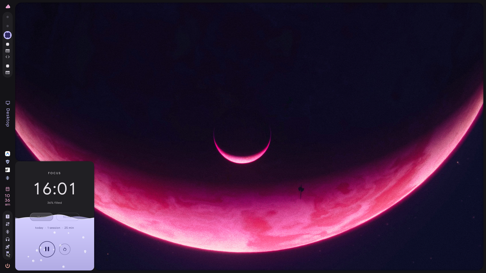
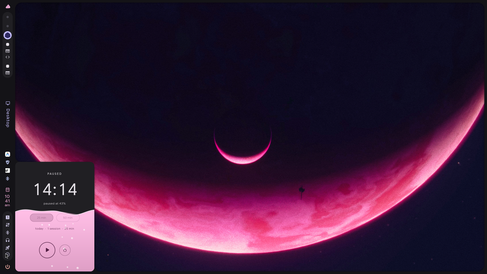

# caelestia-liquid-timer

A focus timer for [Caelestia](https://github.com/caelestia-dots/shell) (Quickshell / Hyprland) where the hover popout **is** the timer: a liquid chamber that fills as you focus. Anything the liquid covers flips to a contrasting color, so the time stays readable while it's submerged.


n

## Features

- Hover the timer icon in the bar and the popout is the chamber, with no extra window or card
- Animated waves and bubbles, a smooth rise, and the liquid drains when you reset
- Submerged text, buttons and chips invert automatically
- Follows your Caelestia color scheme live (Material You palette), including light/dark
- 25 / 50 minute presets, start / pause / reset, and a daily session counter
- Desktop notification when a session ends
- Keybind support through Quickshell IPC

## Requirements

- Caelestia shell (tested on `caelestia-shell 2.5.0`, `quickshell 0.3.1`, Qt 6.11)
- `python3` (for the installer's patch step) and `notify-send` (for the end-of-session notification)

## Install

```sh
git clone https://github.com/24f3003640/caelestia-liquid-timer
cd caelestia-liquid-timer
./install.sh
pkill -x qs; caelestia shell -d
```

The installer copies `/etc/xdg/quickshell/caelestia` to `~/.config/quickshell/caelestia` (Quickshell prefers the user copy), adds two files, and patches two existing ones. Re-running it is safe.

### Keybind

```
# hyprland
bind = SUPER ALT, T, exec, qs -c caelestia ipc call focusTimer toggle
```

IPC calls: `toggle` (start / pause / resume), `start`, `reset`.

## Uninstall

```sh
./install.sh --uninstall
pkill -x qs; caelestia shell -d
```

## Updating the shell

Pacman only updates `/etc/xdg/quickshell/caelestia`, not your copy. To pick up a shell update:

```sh
rm -rf ~/.config/quickshell/caelestia
./install.sh
```

This also discards any other edits you made inside the copy.

## Manual install

If the patch step says an anchor wasn't found (a different shell version), do the two edits by hand after copying `qml/FocusTimer.qml` to `services/` and `qml/FocusChamber.qml` to `modules/bar/popouts/`:

1. In `modules/bar/popouts/Content.qml`, add inside the popout list:
   ```qml
   Popout {
       name: "focustimer"
       sourceComponent: FocusChamber {}
   }
   ```
2. In `modules/bar/components/StatusIcons.qml`, add at the end of `iconColumn` (see `scripts/patch.py` for the exact block). The item needs a `name: "focustimer"` property, which is how the bar picks which popout to open on hover.

## Customizing

- **Presets**: `presets` in `qml/FocusTimer.qml`
- **Corner radius** of the chamber: `cornerRadius` in `qml/FocusChamber.qml` (match it to your popout panel)
- **Size**: `implicitWidth` / `implicitHeight` in `qml/FocusChamber.qml`
- **Stats file**: `~/.local/share/focus-timer/stats.json`

## Troubleshooting

- **Icon missing or popout blank**: run `qs log` and look for QML errors.
- **Corners don't line up with the panel**: adjust `cornerRadius`.
- **Nothing happens after install**: make sure you restarted the shell and that `~/.config/quickshell/caelestia` exists.

## How it works

- `FocusTimer.qml` is a singleton service (state, ticking, stats, IPC) so the timer keeps running when the popout is closed.
- `FocusChamber.qml` draws the liquid on a canvas, renders the UI twice (normal ink, inverted ink), and masks the inverted copy with the wave shape.

## Credits

Built for [caelestia-dots/shell](https://github.com/caelestia-dots/shell). Not affiliated with or endorsed by that project. This repo contains no Caelestia source; the installer patches your local copy.

## License

MIT
